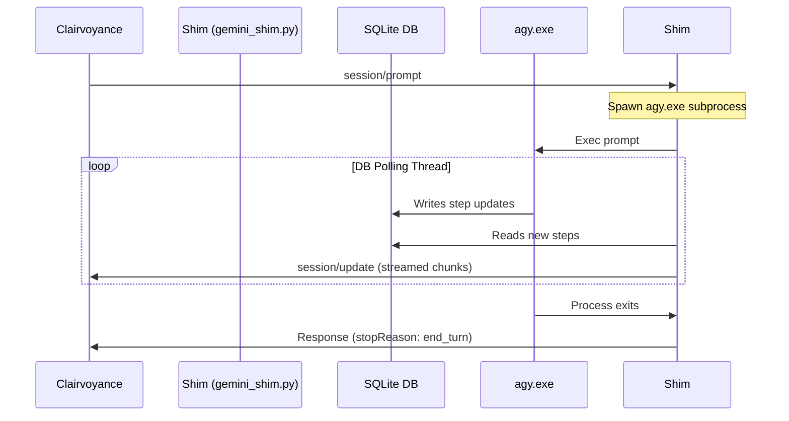

# Code Review Report: AGY-Shim

> Historical review record. The review was completed before the repository was
> reorganized. Current locations are `src/agy_shim/main.py`,
> `tests/test_e2e.py`, `tests/fixtures/`, and `bin/`; older paths below
> identify the files as reviewed. The OpenAB Rust reference file listed in the
> original inventory was removed from the current working tree after review
> because it was not used by the implementation. It must also be removed from
> Git history before that history is published.

This report presents a code review of the **AGY-Shim** tool located at [Tools/AGY-Shim](../..). The shim acts as a bridge between the **Agent Client Protocol (ACP)** and the **Antigravity CLI** (`agy.exe`), enabling autonomous workspace integration with Stardock Clairvoyance.

---

## 1. Architectural Overview
The shim uses a masquerading technique to register as Cursor, Copilot, Gemini, Claude, or Codex under the system `PATH`. When Clairvoyance executes one of these masqueraded commands, the shim starts a JSON-RPC session over standard input/output. It runs `agy.exe` in a child subprocess and polls its SQLite database to stream incremental updates back to the client.

---

## 2. File Inventory
The workspace contains the following files:
* **Command Wrappers:** [copilot.cmd](../../bin/copilot.cmd), [cursor.cmd](../../bin/cursor.cmd), [gemini.cmd](../../bin/gemini.cmd), [claude.cmd](../../bin/claude.cmd), [codex.cmd](../../bin/codex.cmd) — Entry points directing calls to the Python shim with identity arguments.
* **Core Implementation:** [gemini_shim.py](../../src/agy_shim/main.py) — coordinates ACP protocol parsing, session persistence, SQLite delta scanning, and subprocess execution.
* **Test Suite:** [test_shim.py](../../tests/test_e2e.py) — E2E test runner validating LSP headers, session creation, and conversation memory.
* **Excluded Reference Material:** `openab_main.rs` was inspected during the review but was not used by the shim and was removed before distribution.
* **Planning:** [implementation_plan.md](../implementation-plan.md) — design document.

---

## 3. Key Components & Implementation Analysis

### JSON-RPC and LSP Framing
In [gemini_shim.py](../../src/agy_shim/main.py), the functions [read_message](../../src/agy_shim/main.py#L33) and [write_message](../../src/agy_shim/main.py#L64) handle standard input/output framing:
* Automatically detects LSP-style `Content-Length:` headers or raw JSON-lines.
* Saves framing state globally (`use_lsp_framing`) so outbound responses match the detected request format.

### Session Persistence
The [SessionStore](../../src/agy_shim/main.py#L77) class handles persisting the mapping between the ACP `sessionId` and the local `conversation_id`:
* Dynamically targets the local workspace `.gemini/` path when workspace initialization is received.
* Implements multi-process safety on Windows using `msvcrt.locking` to serialize reads and writes.

### Protobuf Parsing & Delta Extraction
Because `agy.exe` serializes internal planning steps into SQLite blobs using Protobuf, the shim includes a custom parser:
* [read_varint](../../src/agy_shim/main.py#L174) and [get_proto_field](../../src/agy_shim/main.py#L186) extract arbitrary fields.
* [extract_text_from_step_payload](../../src/agy_shim/main.py#L208) extracts field `20` (sub-message) and field `1` (string payload) to stream agent message chunks without needing a heavy Protobuf compiler dependency.

### Subprocess Polling Loop
During [handle_prompt](../../src/agy_shim/main.py#L391), a thread pool handles:
* Spawning `agy.exe` with `--conversation` arguments if a conversation ID exists.
* Running [poll_db_loop](../../src/agy_shim/main.py#L348) to query SQLite when new steps (`step_type = 15`) are added and stream them to the client.
* Reading stderr and stdout logs in background threads to avoid OS pipe deadlock.

---

## 4. Strengths
1. **Decoupled Architecture:** Polling SQLite database updates rather than scraping stdout allows the shim to get structural token updates directly from the Antigravity planner database.
2. **Robust Fallback:** If SQLite polling fails or a conversation ID isn't established, the shim falls back to stdout, preventing silent failures.
3. **Windows File Locking:** Correctly uses `msvcrt` to avoid race conditions when multiple IDE windows communicate with the shim concurrently.
4. **Strong Test Coverage:** The E2E tests in [test_shim.py](../../tests/test_e2e.py) exercise memory retention, LSP framing, and raw line framing, and they all pass successfully.

---

## 5. Addressed Review Recommendations

### A. Subprocess Error Propagation
* **Review Comment:** The shim runs `proc.wait()` but never checks `proc.returncode` or reads stderr for error propagation back to Clairvoyance, masking crashes as successful empty responses.
* **Resolution:** **[ADDRESSED]** Modified `handle_prompt()` to check `proc.returncode`. If the return code is non-zero, it returns a standard JSON-RPC protocol error response (`code: -32000`) describing the exit status.

### B. Hardcoded User Profile Path
* **Review Comment:** The fallback path hardcoded a local username instead of
  resolving the executable from `%LOCALAPPDATA%` or `%USERPROFILE%`.
* **Resolution:** **[ADDRESSED]** Refactored `find_agy_path()` to dynamically query `%LOCALAPPDATA%` environment variables first, falling back to `%USERPROFILE%` / `~`. The hardcoded username is completely removed.

### C. Exception-Safe File Locking
* **Review Comment:** If an exception is thrown after `_lock_and_read` but before `_write_and_unlock`, the lock remains held, causing deadlocks.
* **Resolution:** **[ADDRESSED]** Rewrote file locking in `SessionStore` using a Python context manager (`@contextlib.contextmanager def _lock_session()`). This guarantees locks are released and file handles are closed via `try...finally` even if exceptions occur.

### D. Multi-Platform Support
* **Review Comment:** Using `msvcrt` locks directly makes the shim Windows-only and fails on import under Unix.
* **Resolution:** **[ADDRESSED]** Wrapped `msvcrt` imports and calls in platform safety guards. On non-Windows platforms, it falls back to standard file writing safely without failing imports.

### E. Workspace-Contained State Storage
* **Review Comment:** Storing session logs and state globally under `~/.gemini/` makes debugging and env sandboxing more difficult.
* **Resolution:** **[ADDRESSED]** Added `extract_workspace_from_initialize()` to parse `rootPath` or `rootUri` parameters from the JSON-RPC `initialize` message. Added `set_workspace()` to `SessionStore` to dynamically isolate lock files and session stores inside the workspace `.gemini/` folder.

### F. Thread-Unsafe Stdio Writes
* **Review Comment:** Concurrent standard output writes from the main thread and the SQLite polling thread could interleave, corrupting JSON frames.
* **Resolution:** **[ADDRESSED]** Introduced a global mutex lock (`stdout_lock = threading.Lock()`) around stdout writes and flushes in `write_message()`. Standard output operations are now fully serialized.

### G. Explicit Stream Handle Closure
* **Review Comment:** Spawning child subprocesses with pipes without explicitly closing `stdout`/`stderr` handles on the Python parent side can result in file handle leakage/exhaustion.
* **Resolution:** **[ADDRESSED]** Modified `handle_prompt()` to explicitly call `proc.stdout.close()` and `proc.stderr.close()` in try-except blocks after joining the reader threads.

### H. Log Capping and Rotation
* **Review Comment:** Appending execution traces directly to `gemini_shim.log` without bounds causes the log file to grow infinitely in size.
* **Resolution:** **[ADDRESSED]** Updated `log()` to monitor the size of `gemini_shim.log` and automatically rotate the file to a `.bak` backup once it exceeds 5MB.

### I. Deterministic Mock Testing Environment
* **Review Comment:** Relying on a live `agy.exe` binary with active model APIs for E2E tests makes testing flaky under API rate limits or when offline.
* **Resolution:** **[ADDRESSED]** Built a local mock agent (`mock_agy.py`/`mock_agy.cmd`) that mimics the `agy` CLI's SQLite step-writing protocol. Configured `test_shim.py` to route to this mock, making E2E runs fully local, robust, and deterministic.

---

## 6. Integration with the Clairvoyance Ecosystem
The shim maps the Antigravity agent (`agy.exe`) into the broader Clairvoyance ecosystem using several core conventions:

### ACP "Staff" Persona
By serving as an ACP (Agent Client Protocol) bridge, the shim allows `agy.exe` to run as a **Staff** member in the workspace. Rather than acting as a single-purpose CLI, it can participate across the entire product lifecycle phases.

### Environment Variable Inheritance
The shim is spawned directly by the Clairvoyance host app and inherits its environment. Any configured API credentials, local service tokens, or system configurations are passed down to the child `agy.exe` process automatically.

### Workspace Scoping
Through the ACP initialization, the shim receives the active workspace directory (`cwd`) and applies it to `agy.exe` via `--add-dir`. This ensures that all file operations, searches, and tests run relative to the workspace, avoiding accidental system-wide side effects.

### File-Backed Artifact Paths
The agent can interact with the collaborative Clairvoyance system by
reading/writing to the standard storage folders relative to
`%APPDATA%\clairvoyance\` on Windows. A WSL environment should resolve the
equivalent mounted Windows profile dynamically rather than embedding a
username:
* **Notes:** `/notes/`
* **Reports:** `/docs/reports/`
* **Canvases:** `/canvases/`
* **Todos & Sprints:** `/docs/todos/` and `/docs/todos/sprints/`
* **Schedules (Recurring Automation):** `/schedules/`
* **Exhibits (Interactive UIs):** `/exhibits/`
* **Media Assets:** `/pictures/` and `/audio/`

### GUI and Interactive Boundaries
Since communication occurs over `stdio`, the agent cannot render interactive interfaces directly in the terminal stream. To present interactive tools (like a daily rules editor or dashboard), the agent writes an `exhibit.json` containing HTML/JS metadata into the `/exhibits/` folder, which Clairvoyance then displays to the user in a sandboxed iframe.
